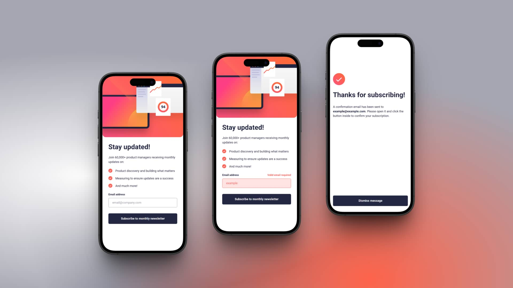

# Frontend Mentor - Newsletter sign-up form with success message solution

This is a solution to the [Newsletter sign-up form with success message challenge on Frontend Mentor](https://www.frontendmentor.io/challenges/newsletter-signup-form-with-success-message-3FC1AZbNrv). Frontend Mentor challenges help you improve your coding skills by building realistic projects.

## Table of contents

- [Overview](#overview)
  - [The challenge](#the-challenge)
  - [Screenshot](#screenshot)
  - [Links](#links)
- [My process](#my-process)
  - [Built with](#built-with)
- [Author](#author)

## Overview

### The challenge

Users should be able to:

- Add their email and submit the form
- See a success message with their email after successfully submitting the form
- See form validation messages if:
  - The field is left empty
  - The email address is not formatted correctly
- View the optimal layout for the interface depending on their device's screen size
- See hover and focus states for all interactive elements on the page

### Screenshot

📱 Mobile

💻 Desktop

### Links

- Solution URL: [https://www.frontendmentor.io/solutions/newsletter-sign-up-form-with-success-message-QD1OyKRe_b](https://www.frontendmentor.io/solutions/newsletter-sign-up-form-with-success-message-QD1OyKRe_b)
- Live Site Here: [https://fermop-newsletter-sign-up-with-success-message-vue.vercel.app/](https://fermop-newsletter-sign-up-with-success-message-vue.vercel.app/)

## My process

### Built with

- Semantic HTML5 markup
- Mobile-first workflow
- [Vue](https://vuejs.org/) - JS library
- [Tailwind](https://tailwindcss.com/) - CSS framework
  - Flexbox

## Author

- Frontend Mentor - [@fermop](https://www.frontendmentor.io/profile/fermop)
- Facebook - [Fernando Mojica](https://www.facebook.com/fernando.mojica.758737/)